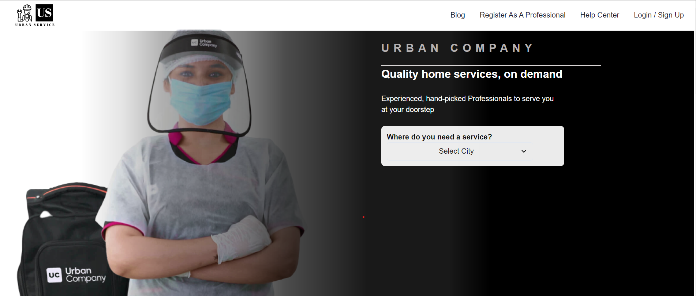
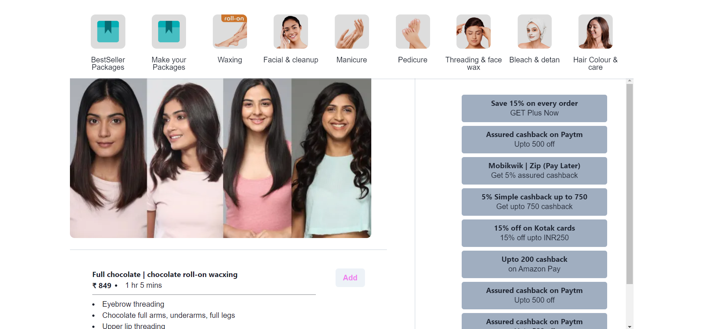

### quack-spoon-1626

1. fp02_065 - Vikas Subhash Pawar
2. fp03_310 - Rajesh Byagalwar
3. fw20_0267 - Vikram Kumar
4. fw20_0701 - Satyam Kumar
5. fw20_0059 - Sahil Khan

## IA Manager - Sanjaykumar Verma

Check the live site <a href="https://urban-service-xi.vercel.app/" target="_blank">here</a>

External dependencies used in the project are ---
1. Chakra UI
2. better-react-carousel
3. firebase
4. framer-motion
5. razorpay
6. react-icons
7. react-modern-drawer
8. react-phone-input-2
9. react-places-autocomplete
10. react-razorpay
11. styled-components
12. sweetalert

Here are some snapshots of the live site --- 

